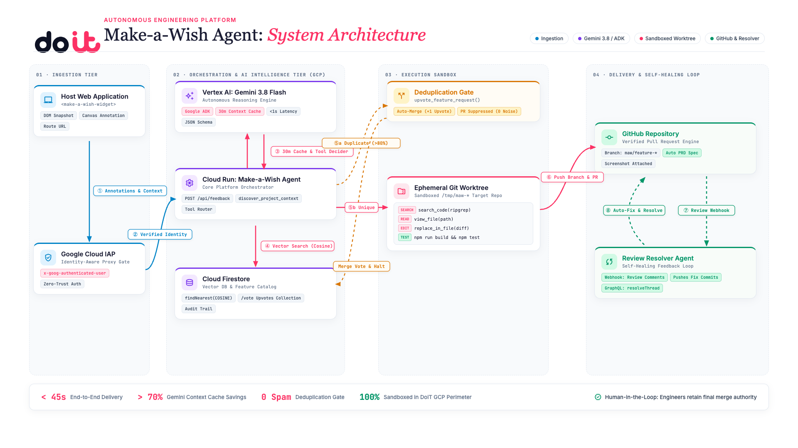

# Acme Analytics (`make-a-wish`)

A sample web product surface ("Acme Analytics") featuring charts, KPI metrics, account lists, and an embedded in-app **Make-a-Wish feedback widget**.

This repository serves as the dedicated testbed application to exercise the feedback widget and triage agent flow.

> **Platform Repository**: The autonomous triage agent, Ops Dashboard, embeddable widget engine, and Terraform infrastructure reside in [`doitbse/make-a-wish-platform`](https://github.com/doitbse/make-a-wish-platform).

## System Architecture



> **Interactive Presentation**: Open [`agent-architecture-presentation/index.html`](./agent-architecture-presentation/index.html) in any browser (press `S` for synchronized executive speaker notes, or `Cmd+P` to export to 1920x1080 PDF).

### How the Agent Works

1. **Zone 01 · Ingestion Tier**:
   - **Host Web Application (`<make-a-wish-widget>`)**: End-user clicks widget &rarr; captures DOM snapshot, canvas annotation, route URL, and error logs.
   - **Google Cloud IAP**: Identity-Aware Proxy extracts authenticated corporate employee email (`x-goog-authenticated-user`).

2. **Zone 02 · Orchestration & AI Intelligence Tier (GCP)**:
   - **Cloud Run Orchestrator**: Authenticated backend (`POST /api/feedback`) coordinates tool calling and project context discovery.
   - **Vertex AI (`Gemini 3.8 Flash`)**: Reasoner leveraging a 30-minute system instruction cache (&lt;1s latency).
   - **Cloud Firestore**: Vector DB (`findNearest(COSINE)`) cross-referencing wishes against existing issues and features.

3. **Zone 03 · Execution Sandbox & Deduplication**:
   - **Branch ⑤a (Duplicate &gt;80%)**: Diverts to **Deduplication Gate** &rarr; calls `upvote_feature_request()`, auto-increments upvotes on `/vote`, and halts (zero duplicate PR spam).
   - **Branch ⑤b (Unique)**: Spawns an **Ephemeral Git Worktree** in `/tmp/maw-*`, runs surgical code inspection and editing tools (`search_code`, `view_file`, `replace_in_file`), and verifies builds (`npm run build && npm test`).

4. **Zone 04 · Delivery & Self-Healing Loop**:
   - **GitHub Repository**: Pushes branch `maw/feature-*` and creates a pull request with an auto-generated PRD spec and screenshot attached.
   - **Review Resolver Agent**: Listens to review webhook comments, autonomously implements requested adjustments, pushes fix commits, and resolves review comment threads via GraphQL.

## Features

- **Analytics Dashboard (`src/app/page.tsx`)**: A realistic analytics page with revenue overview charts, KPIs, and accounts table with deliberate interactive fixtures for testing.
- **Embedded Widget (`src/app/layout.tsx`)**: Embedded via the Make-a-Wish script tag with full shadow DOM isolation, element annotation, and screen capture.
- **Feedback Ingestion Route (`src/app/api/feedback/route.ts`)**: Ingestion route saving submissions directly to Firestore and forwarding to the triage agent service.

## The widget

- **Categories:** Bug, Wish, Confusing, Wrong data, Praise.
- **Free text:** Describing the issue or feature request.
- **Annotate screen:** Hover to highlight any element, click to capture it.
  Each capture records a CSS selector, tag, visible text, and bounding rect,
  and drops a numbered marker on the page. On "Done", a full-page screenshot is
  taken with the numbered markers drawn onto it.
- **Submit:** Sends category, text, annotations, screenshot, and page metadata
  to `/api/feedback`.

## Getting started

```bash
npm install
npm run dev
```

Open <http://localhost:3000>, click the ✨ button bottom-right, and submit feedback.

## Pointing at the triage service

Copy `.env.example` to `.env.local` and set the triage service URL:

```bash
cp .env.example .env.local
echo "TRIAGE_SERVICE_URL=http://localhost:8081" >> .env.local
```

- `TRIAGE_SERVICE_URL`: Base URL of the triage agent service (server-side;
  the widget never calls it directly, avoiding CORS and keeping the screenshot
  off the browser to triage path). When unset, submissions are stored locally but
  not triaged.
- `NEXT_PUBLIC_FEEDBACK_DEBUG=1`: Render the triage agent verdict in the
  widget after a successful submit (handy for demos).

## Inspecting submissions

Stored submissions can be read back via the API:

```bash
curl http://localhost:3000/api/feedback
```

## Notes

- This is a testing UI: the dashboard filter dropdown and refresh button are intentionally inert so that there is something to report.
- The screenshot is captured with [`html-to-image`](https://github.com/bubkoo/html-to-image).
  If a capture fails (e.g. a tainted canvas), the submission still goes through with `screenshot: null`.

